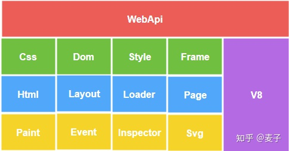
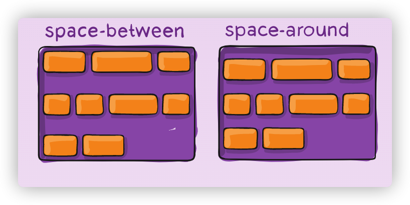

# Week04 学习笔记

## 本周总结

这一周的代码量特别大，由于也没有别的练习题，所以基本靠直接看，其实布局的很多东西都没完全理解，很多术语都没看懂，抽空自己学习了布局相关的知识

之前一直觉得 CSS 真的很难学，很难系统的掌握，好像什么都都懂一点，又很难系统掌握好。这一次经过 Flex 的布局计算之后，感觉稍微有点摸到了门路。

抽空了解了 CSS 几代的布局历史和知识点。而且我一直有一个误解，一直以为这几代 css 布局都是互相补充的关系，经过这次的 `toy browser` 之后，才知道他们是互相替代的关系(除了为了兼容）。

对于现代浏览器来说，我是不是可以理解为，只要掌握 flex 布局，基本可以完成大部分的任务。面向未来的话，可以再掌握 grid 布局。

现在有点期待后面的 CSS 课程，可以进一步系统学习 CSS。

## Toy-Browser 总结

ToyBrowser 告一段落，虽然只是最基础的功能，但最重要的是，从另外一个角度，浏览器设计者的角度来看待 前端，这个时候有很多以前的疑惑都理解，而且更系统也更全面。

然后我有兴趣翻阅了现代浏览器的架构，发现其实我们还只是其中的一小部分，例如，webkit, blink，toy-browser 只是浏览器内核的一小部分而已。

但是，之前 很模糊的概念，现在至少清晰了许多。或许我可以像下面一样大概定个位置。

1. HTML - 解析 HTML

2. DOM - DOM 树构建

3. CSS - CSS 解析 （对应的是 npm css 完成的部分）

4. Style - CSS Compute 计算样式

5. Layout - 布局、排版

6. Paint - Render (对应的是 npm images 完成的部分)

也许照着 blink 这个图，也可以继续完善其他基本功能。

## Flex 布局代码上的一些术语理解

代码里面有很多 Flex 布局的术语，看得云里雾里。

Main Start，Main End，Main Size
Cross Start, Cross End， Cross Size

这些都比较好理解。

但这些：

* Main Base
* Main Sign
* Cross Base
* Cross Sign
* Main Space
* Cross Space

理解起来就很抽象了，想看懂代码，只能先啃一啃这些基础概念。

1. 先来看：Main Space，Cross Space

从代码上看，Space 的涵义，就是现在 容器剩下的空间大小

因此：align-content，space-between，space-around 这两个，也是同一个意思，他们都是指 剩余空间

Space-between，就是字面意思，space between content

Space-around，也是字面意思，space around content

2. 然后再看 Main Base, Cross Base

Base 其实是布局到当前元素的时候，当前轴的位置，如果是 reverse 就是当前轴的长度了，例如：主轴是行的话，就是 `width`，交叉轴就是 `height`。

3. Main Sign, Cross Sign

这个只要根据 reverse 代码，也能理解 sign 就是正向反向的意思了

## 本周作业

1. npm i

2. npm run server

3. npm run client

4. 生成 output 文件夹
