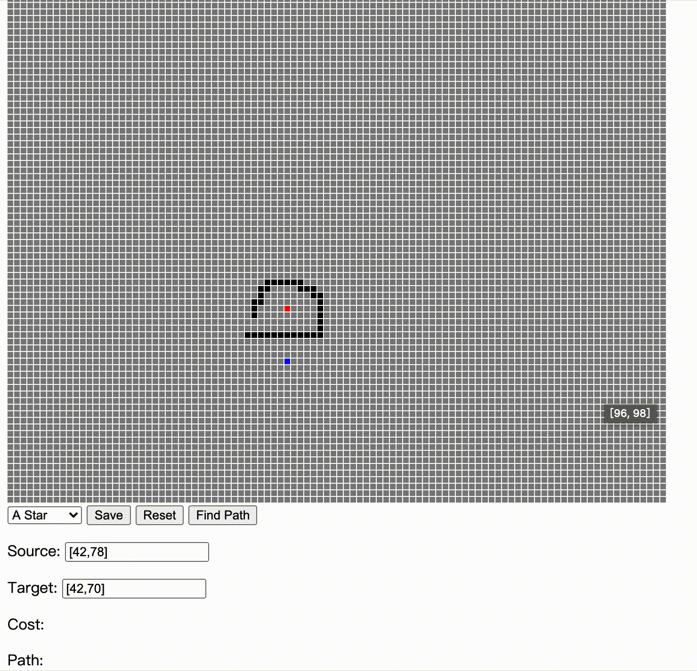
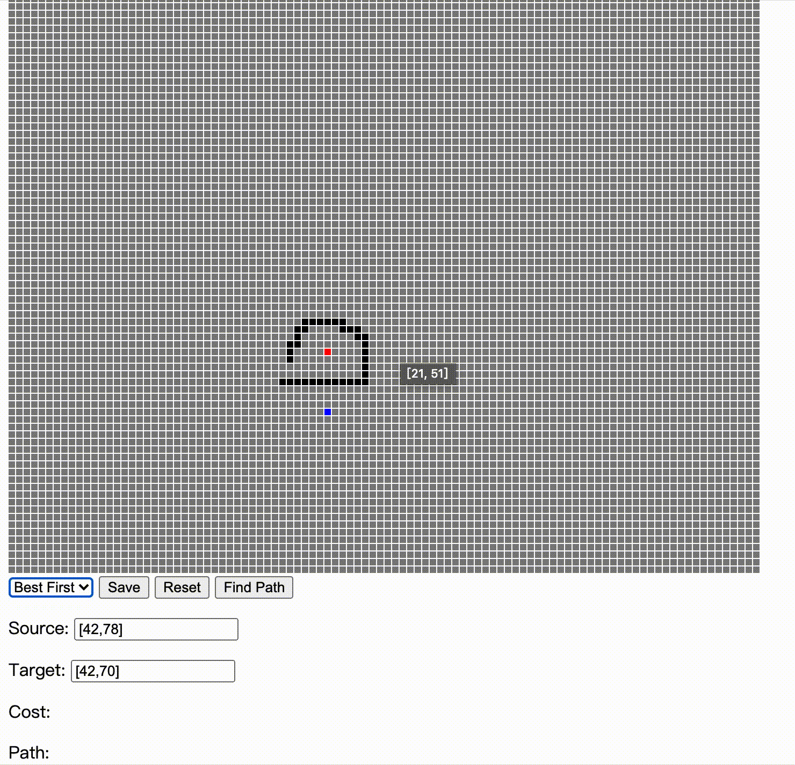

# 第九周

## 总结

本周学习了，寻路相关的算法，有广度优先的算法，和启发式搜索算法。

然后结合上周的 五子棋，其实可以用启发式搜索算法来加速，看完本周的才知道，启发式原来是这样的意思。

## 本周作业

### 二叉堆

这周的可选作业并不是很难，二叉堆的实现，二叉堆是一个常见的数据结构，虽然从来没用过，但是实现起来相对简单

### 优化路径问题

但是另外一个优化路径的问题，就很麻烦了，苦思冥想了很久都不知道怎么解决，最后去了解了一下，整个寻路算法的大背景，接触了 A* 算法，把整个 A* 算法写了一遍，最后才发现我感觉我题目都搞错了。

我理解的优化：减少一些多余的 Cost （就是绿色的点），提升性能

题目中的优化：启发式搜索，返回的路径并不是最优路径

因为我发现，同样的起点和终点，使用 AStar 的耗费反而是更高的，所以一开始理解错了题目，导致我研究了很久。最后才知道我理解错了。

使用 AStar

普通的 启发式

可以看到使用了 Astar 之后，必定能找到最优解，但并不是 Cost 最小的

方向错了，再怎么努力也是错的。理解题目很重要。
